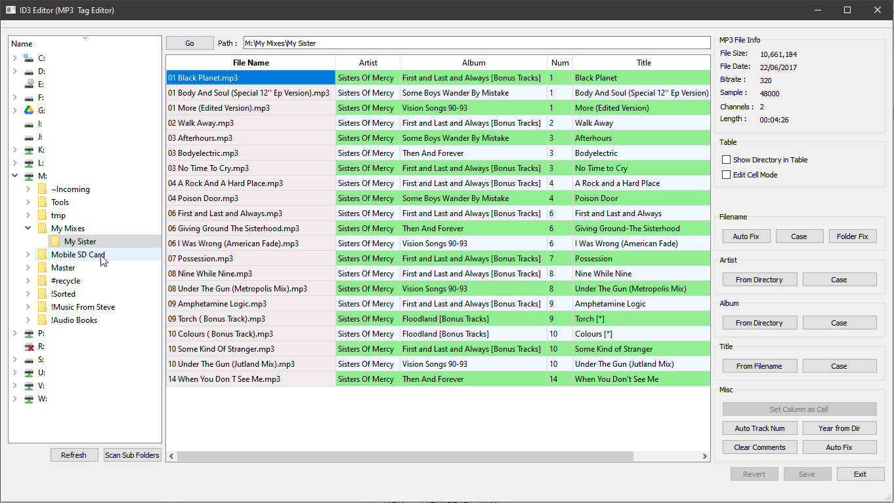

# QT-ID3Editor
MP3 ID3 tag information editor with UI and some automation. 

Written in C++ for QT4.  Builds in QT5.  Not tried in QT6.
Only ever built for Windoews x64 but should work on any platform supported by QT and TAGLIB.

Depends on TAGLIB library for actual ID3 editing.
https://taglib.org/

Supports time saving automation features to update multiple MP3 files at the same time.

